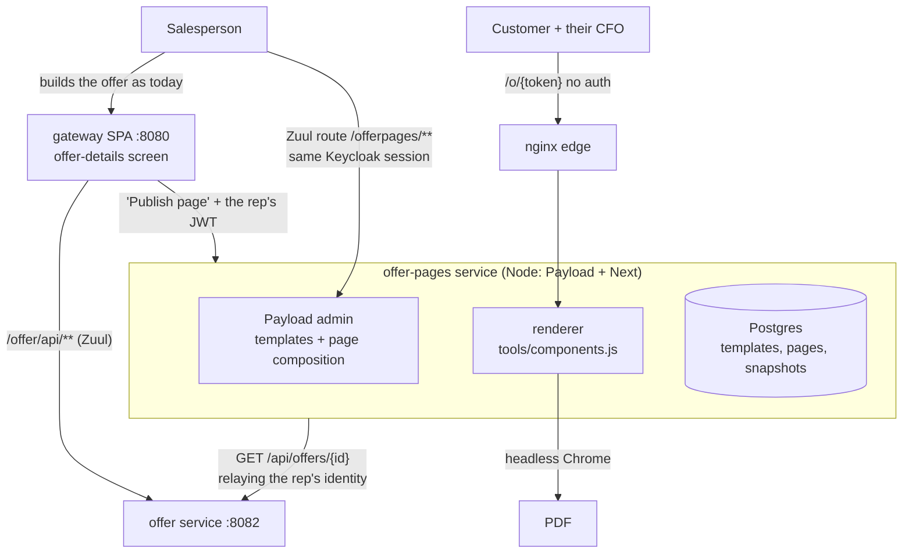

# Offer Pages — Payload as the offer document layer

Status: **proposal, not started**
Drafted: 2026-09-07
Scope: let a salesperson publish an approved offer as a branded, public landing
page (and a PDF) assembled from ready-made blocks — prices, discounts, optional
items, additional products — without rebuilding any part of the offer domain.

Companion to [BLOCKS-PLAN.md](BLOCKS-PLAN.md), which builds the component
palette this plan consumes.

---

## 1. Decisions

| # | Decision | Answer |
|---|----------|--------|
| D1 | What Payload owns | **The document template and the narrative copy. Never the numbers.** |
| D2 | Where commercial data comes from | `offer` service, read **as the signed-in rep** — their JWT plus tenant and account context, relayed at publish time only. Snapshotted, never live-fetched by the public page. Not `externalgateway`; see §4.1. |
| D3 | Who builds a page | **Salespeople**, in Payload's admin, reached from the gateway SPA menu. |
| D4 | Where the admin lives | A **separate Node service** behind a Zuul route, sharing the Keycloak session. Payload cannot mount into a React 17 + Spring SPA. |
| D5 | Where the public page is served | Through the **edge nginx that already fronts both gateways** — forwarded either directly to offer-pages or via a Zuul route on the internal `gateway`; pick on config reviewability (§7.1). **Not** through `externalgateway` — see §7.2. |
| D6 | Marketing content | **Copied over**, not synced. This project does not depend on BLOCKS-PLAN phases 4–6. |
| D7 | Acceptance | A published page's numbers must equal the offer's own totals, and must expose **no internal money fields** — see §5.1. |
| D8 | Document types | **Two.** An *offer page* bound to an `Offer` (snapshot, projection, status gate) and an *opportunity presentation* bound to a `SaleCase` (narrative only, no numbers). See §3.1. |
| D9 | Platform data in the admin | Payload **reads** accounts / opportunities / offers live, as the rep. It **never mirrors** them — ids plus a display label only. See §6.1. |

---

## 2. What already exists — and must not be rebuilt

### 2.1 The offer domain is mature

`offer` (`:8082`) owns the whole commercial spine:

- The `Offer` aggregate and its recursive `OfferElement` tree (`offer_element`,
  single-table inheritance, positional `HierarchyKey`).
- Six totals types — VALUE, COST, RFA, PROFIT, COMMISSION, CONTRACT_VALUE —
  computed per element, per section and per offer.
- JAR-pluggable validation plus GraalVM-JS expression rules.
- Rule-driven, role-based approvals (`OfferApprovalsSelectionService`).
- The lifecycle `DRAFT → AWAITING_APPROVAL → APPROVED → ACCEPTED`, from which
  Orders, Agreements, Subscriptions and downstream billing all follow.

**A non-DRAFT offer is essentially frozen** (`update` only mutates `costPrice`
of `fiber` elements). That is load-bearing for this plan — see §7.

Nothing above belongs in a CMS. Reproducing any of it creates a second pricing
engine that will drift from the one the company sells.

### 2.2 The gap: the document template

An offer becomes a customer-facing document like this:

```
GET /api/offers/{id}/pdf          OfferFilesResource
  → OfferPdfService.createOfferPdf
      builds OfferPdfContext  (offer DTO + tenant + account + supplierInfo + 3 totals)
      filterOfferElements      keeps printSettings.showElementInPdf,
                               nulls description when !showDescriptionInPdf
  → ThymeleafHtmlGenerator     requires templateCode + languageCode;
                               fetches the template BODY from the dictionaries service
  → OpenHtmlToPdfConverter     openhtmltopdf/iText, Noto fonts only, testMode(true)
```

Static base templates (`templates/offer/offerTemplate.xhtml`,
`offerTemplateRecurring.xhtml`) carry the CSS, the A4 `@page` rules, the running
header and the DRAFT watermark — but **production bodies usually come from the
dictionaries service**.

So the customer-facing template today is:

| | Today |
|---|---|
| Format | Thymeleaf XHTML, stored as a dictionary entry, one per language |
| Authoring | Raw markup, edited in a dictionaries screen |
| Variable binding | Reflective — *every* `OfferPdfContext` field silently becomes a template variable |
| Type safety | None. The KB's own assessment: "couples template names to field names with no compile-time check" |
| Preview | None |
| Version history | None |
| Design ownership | Developer-only |
| Output | PDF only. No web page, no link to forward |

That is the hole. It is a *presentation* problem, and it is exactly what a
block-based CMS is for.

### 2.3 What carries over from the website work

BLOCKS-PLAN phase 2 already produced the expensive half of the palette:

- `components/` — `page-hero`, `page-hero-split`, `cta-band`, `feature-grid`,
  `split-prose`, plus `components/visuals/` (`q2c-board`, `module-grid`,
  `innovate-forecast`).
- `tools/components.js` — the renderer. Pure: `render(template, instance, page,
  loadInclude)`, no `fs`, the include loader is injected. `{{slot:}}`,
  `{{prop:}}`, `{{#if}}`, `{{#each}}`.
- `src/index-print.html` — a proven A4 print stylesheet: `@page { size: A4 }`,
  `break-after: page` per section, `print-color-adjust: exact`.

One friction: the website repo is `"type": "commonjs"`, `cms/` is
`"type": "module"`. `tools/components.js` must be dual-published or converted
before both worlds share it. Half a day.

---

## 3. The principle

> **Payload owns the template. The offer service owns the truth.**

A published page is a *rendering* of an offer, not a copy of one that can be
edited. The rep composes which blocks appear and in what order; every number on
the page comes from the offer, through an allow-listed projection, snapshotted
at publish.

This is what keeps the feature from becoming a second CPQ, and it is why "it
doesn't need to be connected with agree-tech data" is nearly right: Payload
holds no commercial data at rest except the snapshot it renders.

### 3.1 Two document types, not one

"Offer / presentation" is two things, and separating them puts almost all the
risk in one of them:

| | **Offer page** | **Opportunity presentation** |
|---|---|---|
| Bound to | an `Offer` | a `SaleCase` (opportunity) |
| Numbers | snapshot + allow-listed projection (§5.1) | none |
| Publishable when | `APPROVED` or `ACCEPTED` only | any time |
| Margin-leak risk | the whole §5.1 apparatus | **none — there are no numbers** |
| Needs a snapshot | yes | no |

They share the palette, the renderer, the auth relay, the tenant plumbing and the
public delivery path. They differ only in whether commercial data is involved.

**This changes the phase order** (§8): the narrative type exercises every piece
of infrastructure without touching a single money field, so it ships first and
the commercial type follows once the projection and its gate are proven.

---

## 4. Target architecture



Four properties worth stating:

1. **The public page never talks to the platform.** It renders a snapshot. A
   customer's browser cannot reach `externalgateway`, `offer`, or Keycloak.
2. **The admin is reached through the gateway**, so a rep sees one menu and one
   login.
3. **Every offer read happens as a real user**, at the moment of a click — see
   §4.1. There is no service identity and no background read.
4. **The renderer is shared** with the marketing site, so a block looks the same
   on agree-tech.com and on an offer page.

### 4.1 Identity: read as the rep, never as a service

The obvious shape is a service account calling `externalgateway` with an API
key. **It does not work**, and the reason is the platform's own security model.

`offer` scopes almost every query by **account subtree** — the `relation`
closure table plus a Hibernate `@Filter`, driven by
`SecurityUtils.getCurrentUserAccountId()`. An `externalgateway` API key resolves
to a **tenant**, via the cached `TenantApiUser` map. That yields a tenant header,
not a meaningful account position, and the KB is explicit that **"null
`accountId` is a hard failure — system/API tokens need an accountId or the
unauthorized methods."** So a service key lands in one of two bad places:

| | Consequence |
|---|---|
| Scoped to a narrow account | The offer is outside its subtree. The read returns nothing. |
| Parked at the tenant root | A service that publishes *public pages* holds a key to every offer in the tenant. |

The snapshot decision (§7) removes the need for either: **the only time offer
data is read is the instant a rep clicks Publish**, and the rep is present with a
session carrying concrete tenant *and* account context. So the SPA passes that
identity through and offer-pages relays it to `offer` directly
(`offer-app:8082`, which validates JWTs against UAA itself — no proxy hop
needed).

**Relay all four**, not just the token — `TenantContext` is a separate
thread-local from `accountId`:

```
Authorization: Bearer <the rep's JWT>
X-TenantId:      the tenant the rep is acting in
X-Language:      localized SKU / description text
X-AccountContext: where that tenant has account-context enabled
```

Dropping the tenant header reads against the wrong tenant with a valid token.

Three consequences, all improvements:

- **`externalgateway` leaves the design entirely.** It is the partner API edge
  for machines with API keys; this is neither. Its `ROLE_API` requirement would
  reject a rep's token anyway.
- **Authorization is free.** A rep who cannot see the offer gets nothing back —
  the same filter that guards the offer-details screen guards the publish. No
  separate permission model to invent.
- **There is no credential to steal.** Compromising offer-pages yields the
  snapshots already published, not the sales database.

Two caveats to verify rather than assume:

1. `GET /api/offers/{offerId}` is `@Secured(USER)` and, per the KB, "not
   access-checked beyond `@Secured`" — protection comes from the account filter.
   The KB warns separately that "a `@Secured` method with a repo call that lacks
   the account filter **still leaks**." Confirm the filter applies on the exact
   endpoint used before relying on it as the authorization gate.
2. **Re-publishing.** A *template* change re-renders from the stored snapshot and
   needs no identity at all. Only a *data* refresh needs a rep, and that is a
   deliberate click. If deferred work is ever needed here, the platform's
   existing pattern is `OnBehalfUserContext`, which re-impersonates the original
   creator so account scoping still applies.

---

## 5. The block palette

Every commercial block maps to something the offer domain already has. Nothing
is invented.

| Block | Source in the offer domain |
|---|---|
| `price-table` | `OfferElement` tree, filtered by `printSettings.showElementInPdf`; `Totals.value` initial + recurring |
| `discount` | per element: `catalogPrice` vs `offeredPrice` |
| `optional-items` | elements flagged optional in `printSettings` / `additionalMetadata` |
| `additional-products` | `GET /api/agreements/{id}/availableToBuy` — "elements the account can buy" |
| `contract-terms` | `contractLength`, `startDate`, `expiryDate`, `pricePlan`, `currency` |
| `customer-header` | the embedded `Customer` (company name, contact, address) |
| `next-step` | static, plus the rep from `Offer.owner` |

Narrative blocks (`page-hero`, `split-prose`, `feature-grid`, `cta-band`,
`q2c-board`, …) come from `components/` unchanged and are filled from Payload's
own localized copy, copied over from the marketing site.

### 5.1 🔴 The allow-listed projection — the single most important rule

`OfferPdfContext` today exposes **every field reflectively**, and the offer's
totals include **COST, PROFIT and COMMISSION**. On an internal PDF that is
merely risky. On a **public URL** it is a commercial disaster: a customer, or a
competitor with the link, reads your margin.

Therefore the offer-pages service must **never** hand a raw offer DTO to a
template. It builds an explicit projection:

```
allowed:  name, currency, contractLength, startDate, expiryDate, validUntil,
          customer.*, owner (display name only),
          per element: sku, description, qty, offeredPrice, catalogPrice,
                       totals.value.initial, totals.value.recurring
          offer totals: VALUE (initial + recurring), CONTRACT_VALUE

denied:   COST, PROFIT, COMMISSION, RFA, fixedProfit, productCommission,
          costPrice, rfaPrice, requiredApprovals, validators,
          approvalSelectors, internal ids
```

The gate in §8 tests this directly: a published page's HTML must contain no
denied field, asserted against a fixture offer that has non-zero values in all
of them.

---

## 6. Where the admin lives, and how auth works

The gateway SPA is **React 17 + Spring Boot / Zuul**, not Next.js, so Payload
cannot be mounted into it. The realistic shape is a sibling service:

1. **Deploy** `offer-pages` as a Node container in the same docker-compose
   stacks (dev / demo / prod), alongside `externalgateway-app`.
2. **Route** it through the internal gateway's Zuul: `/offerpages/**` →
   `offer-pages`. Same origin, same nginx, same cookie domain, so no CORS and no
   second hostname.
3. **Menu** — the gateway's nav is config-driven (`frontend.menuConfiguration`
   in `application.yml`, served by `MenuConfiguration.java`). Adding "Offer
   pages" is a config change, not a frontend change.
4. **Auth** — a Payload **custom auth strategy** that validates the same
   Keycloak JWT (realm `bpmmicro`, client `web_app`) against the realm JWKS, and
   maps platform roles onto Payload roles:

   | Platform role | Payload capability |
   |---|---|
   | `ROLE_ADMIN` | edit templates and blocks |
   | sales roles (offer owner / `SALES_CASE_MANAGER`) | compose and publish pages |
   | everyone else | no access |

   No second login, no user table to keep in step.
5. **Tenancy** — every Payload collection carries a `tenant` field, and access
   control filters on the active tenant. This is the part with no framework
   support and the most room for error; see §6.2 and §9.

### 6.1 Reading platform data from the admin

Composing a page means picking an opportunity, and sometimes an account or a set
of cross-sell products. So Payload's admin becomes a client of the platform's
query APIs — a larger surface than §4.1's single read, but **the same identity
model**, because the rep is present with a live session. Read as the rep and the
account-subtree filter returns exactly the right rows with no filtering logic of
our own.

| Need | Endpoint |
|---|---|
| The rep's own opportunities | `GET /offer/api/offers/my-offers` — already filtered to owner / createdBy |
| Sale cases (opportunities) | `GET /offer/api/saleCaseViews` |
| Accounts | `GET /offer/api/accounts` + the details URL |
| Cross-sell products | `GET /offer/api/agreements/by-account/{id}/availableToBuy` |

Mechanically this is a Payload **custom endpoint** per lookup (where `req.user`
and the relayed headers live) behind a **custom field component** in the admin.

Three rules:

- **Never mirror.** Store `saleCaseId` / `offerId` / `accountId` plus a
  denormalized display label for list views. A synced copy of accounts is a
  second source of truth and a tenancy incident waiting to happen; a stale label
  is cosmetic and refreshes on open.
- **Minimize the pickers.** The offer-details screen already initializes from
  `accountId`, `saleCaseId`, `frameAgreementId` query params — the platform's
  established launch-with-context pattern. "Publish page" carries that context
  onward, so the common path needs **no account picker at all**. The one picker
  worth building is an **opportunity picker**, for starting a presentation
  against a sale case that has no offer yet.
- **Do not cache across users.** A typeahead will be chatty, but an account list
  cached without the rep's identity in the key leaks across account subtrees.
  Cache per `(user, tenant)` with a short TTL, or not at all.

> ⚠ `OfferQueryResource`'s list endpoints carry **no `@Secured`** — protection is
> the global URL rules plus the account `@Filter`. Relaying the rep inherits
> that, which is correct, but it means the filter is the only thing standing
> between a rep and another subtree's rows. Verify it, per §4.1's first caveat.

### 6.2 Tenant is session state, not a user property

The trap. A rep can switch tenants in the SPA — `setTenant()` resolves
query ▷ user-default ▷ default ▷ first — so "the user's tenant" is not something
Payload can look up. The active tenant must **arrive with every request** and be
**pinned onto the page record at creation**.

Get this wrong and a rep composes a page against the wrong tenant's accounts
with an entirely valid token, and nothing errors.

---

## 7. The public page

- **URL:** `/o/{token}` where the token has real entropy. Public means "no login
  for the whole buying committee", not "enumerable".
- **`noindex, nofollow`**, absent from any sitemap, `Cache-Control: private`.
- **Publishable only from `APPROVED` or `ACCEPTED`.** This is free correctness:
  a non-DRAFT offer is already frozen by the domain, so the page cannot drift
  from what was approved.
- **Snapshot at publish.** The service reads the offer once through
  `externalgateway`, stores the projection, and renders that. Re-publishing
  takes a fresh snapshot and supersedes the old page.
- **`validUntil` is enforced**, not decorative — an expired page renders a lapse
  notice, not last quarter's discount.
- **PDF** via headless Chrome against the same HTML plus the `index-print`
  stylesheet, so the page and the attachment cannot disagree.
- **Interactive is fine; calling back is not.** Expand/collapse, tabs, a print
  view, and toggling optional add-ons to see a subtotal move are all welcome —
  provided every one computes **client-side from the snapshot**. The page must
  never reach `calculate-totals` or `validate`; those are rep-authenticated and
  stay that way. Where a toggle changes a displayed total, label it indicative
  and name the offer's own total as the binding one.

### 7.1 Which proxy forwards it

The edge **nginx already fronts both gateways** — it terminates TLS and reverse-
proxies one domain per env to the internal `gateway` (`:8080`) and to
`externalgateway` (`:8490`), and is a `depends_on` of nearly every service. So
this is not "nginx *or* the gateway": everything goes through nginx already. The
only choice is what nginx forwards `/o/**` to.

| | nginx location block | Zuul route on `gateway` |
|---|---|---|
| Config lives in | the compose repos; the base `docker-compose.yml` each env `extends:` is **gitignored**, so some edge wiring is not visible in-repo | `application.yml` via Spring Cloud Config, backed by Bitbucket `cloud-config/<env>` — **version-controlled and reviewable** |
| Blast radius of a mistake | exposes one service | the same `SecurityConfiguration` that guards `/api/**` for every operator |
| In the request path | nothing | Zuul 1 + Ribbon + Hystrix, on a page that is effectively static |
| Consistency | a special case to remember | how everything else already routes |

**Either is acceptable.** Decide on config reviewability — a rule nobody can
review in a pull request is worse than one with a slightly wider failure mode.
What is *not* optional, whichever is chosen:

- the public path is an **exact prefix**, never a wildcard that could widen;
- it is **version-controlled**;
- a test asserts `/o/*` serves anonymously **and** `/api/*` still returns 401.

### 7.2 Why `externalgateway` is not in this design at all

It was the obvious candidate twice, and it is wrong both times — for two
different reasons worth keeping straight.

**For the offer read** (§4.1): its model is apiKey → tenant, which yields no
account position, and `offer` scopes by account subtree. A service key is either
too narrow to see the offer or broad enough to see every offer in the tenant.
Reading as the rep removes the need for it.

**For the public page:** not because of the `ROLE_API` check —
`RoleApiZuulFilter` could be carved out, and there is precedent (the order-export
endpoint is `permitAll()` in Spring Security, guarded by an `X-API-KEY`
interceptor instead). The structural reason is again **tenant resolution**: an
anonymous customer browser carries no key, so nothing resolves, and the tenant
for `/o/{token}` is a property of the page record that only offer-pages knows.

So `externalgateway` keeps doing exactly what it does today — the partner API
edge for machines holding keys — and this project does not touch it.

---

## 8. Phases

Each phase ends with a gate that must pass before the next begins.

### Phase 0 — Standalone, fixture data (~1 week)

Payload up, `Offer Templates` and `Offer Pages` collections, the seven
commercial blocks written, narrative copy copied from `content/`, renderer
shared out of `tools/components.js`. Reads a **fixture offer JSON** — no
platform integration at all.

**Gate:** a page renders from a fixture; the block palette covers a real
offer's shape.

### Phase 1 — Auth and placement (~1 week)

Keycloak JWT auth strategy, Zuul route, menu entry, tenant field + access
control on every collection.

**Gate:** a rep logs into the gateway, clicks "Offer pages", lands in Payload
already authenticated. A rep from tenant A cannot see tenant B's templates —
tested, not assumed.

### Phase 2 — Platform reads in the admin (~1 week)

The identity relay of §4.1, the opportunity picker, the custom endpoints behind
it, and tenant pinning (§6.2). No commercial data yet.

**Gate:** a rep's opportunity picker shows their account subtree and nothing
else — verified by querying as a rep whose subtree excludes a known sale case.

**Gate:** a page created while acting in tenant A carries tenant A, and is
invisible to a rep acting in tenant B.

### Phase 3 — Opportunity presentations, end to end (~1 week)

The **narrative** document type: bound to a `SaleCase`, no numbers. nginx route,
tokens, expiry, `noindex`, the lapse state. This exercises the palette, the
relay, the tenant plumbing and public delivery **without a single money field
in play**.

**Gate:** a presentation composed from an opportunity loads publicly with no
session, and expires.

### Phase 4 — Offer pages: projection and snapshot (~1.5 weeks)

Only now does commercial data enter. The allow-listed projection,
snapshot-on-publish, the `APPROVED`/`ACCEPTED` status gate.

**Gate 🔴:** a page rendered from a fixture offer with non-zero COST, PROFIT,
COMMISSION and RFA contains none of them anywhere in its HTML. Automated, and
run on every build thereafter.

**Gate:** a rep can publish only offers they can already see — verified by
attempting one outside their account subtree and getting nothing back, not by
inspecting the code path.

**Gate:** totals on the page equal the offer's own totals.

### Phase 5 — PDF (~3 days)

Headless Chrome against the same HTML.

**Gate:** the PDF's text content equals the page's.

### Phase 6 — Wire into the offer screen (~3 days)

A "Publish page" action in the offer-details toolbar (`details/header/actions/`
— copy `send-to-approval.js`), carrying `accountId` / `saleCaseId` / `offerId`
context onward so Payload needs no account picker. Plus the link on the offer.

**Gate:** publish, open, and forward the link, entirely from the offer screen.

**Total: roughly 6 weeks.**

The reorder is the point: **everything through Phase 3 ships without touching a
money field.** All the infrastructure risk is retired before any commercial risk
is taken on, and if the project stalls after Phase 3 what exists is still useful.

---

## 9. Risks

| Sev | Risk | Mitigation |
|---|---|---|
| 🔴 | **Margin leak.** COST / PROFIT / COMMISSION reaching a public page. | The allow-list in §5.1 and the Phase 2 gate. Never pass a raw DTO. |
| 🔴 | **Tenant bleed in Payload.** Payload has no built-in multi-tenancy; the platform's own isolation (`relation` closure table + Hibernate `@Filter`) does not extend to it. | Tenant field + access control on every collection, tested in Phase 1. Treat a missing filter as a P0. |
| 🟠 | **A service identity that can read every offer.** The failure mode §4.1 exists to avoid. If a future change reintroduces a background read, the tempting fix is a tenant-root API key. | Keep every offer read user-initiated. If deferred work becomes necessary, use `OnBehalfUserContext` so account scoping still applies — never a static key. |
| 🟠 | **No rate limiting on `/o/*`.** Unauthenticated pages in front of the sales engine invite scraping. (`externalgateway` also has rate limiting disabled in dev and prod — unrelated to this project now, but worth fixing on its own merits.) | Rate-limit at nginx for the public path before Phase 3 ships. |
| 🟠 | **A Node service in a Java/Eureka estate.** Different build (Jenkins), different runtime, no native Eureka registration, new on-call surface. | Static Zuul route rather than service discovery; treat it as infrastructure work, not a rounding error. |
| 🟠 | **Customer PII on a public URL.** The embedded `Customer` carries contact person and company address; the platform is EU/Danish. | Retention clock on pages, purge on expiry, privacy notice, DPA for the hosting. |
| 🟡 | **Two PDF pipelines.** openhtmltopdf for the existing document, Chrome for the new one. | Accept the divergence deliberately; do not migrate invoice PDFs. Revisit only if the old path is retired. |
| 🟡 | **Template/field coupling survives.** Blocks still name offer fields. | The projection is now an explicit, reviewable contract — strictly better than reflection, but it still needs a test when a field is renamed. |

---

## 10. Open questions

1. **Does a page need approval of its own?** An offer's numbers are approved;
   its narrative framing is not. A rep could publish a page whose copy
   overpromises. Worth deciding whether publish is gated by the same roles that
   gate `accept`.
2. **What happens when an offer is superseded?** Add-on and renewal offers
   reference a parent. Should publishing a renewal retire the parent's page?
3. **Read tracking.** "Viewed 3 times, forwarded twice" is valuable to sales and
   is also analytics on a named person — a GDPR question before a technical one.
4. **Which service owns the block palette long term?** Sharing
   `tools/components.js` between a marketing site and a platform service is
   right for now and becomes a versioning problem once both move independently.
   A small published package is the obvious answer, later.
5. **Do offer pages belong in the KB survey scope?** Once built, this is a new
   service and the KB's index rule applies — it needs a book, or at least a row
   in `platform/service-catalog.md`.
